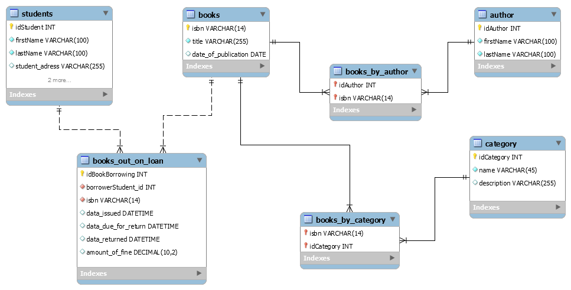

#Template the Spring with annotations and the following technologies:

-Spring Data JPA
-Spring MVC
-Thymeleaf Engine
-Maven Technology

##Database

###The diagram of the dataBase is made in MySQL, you can find the schema and the script in the following directory:

extra/Library_for_Students.mwb
extra/Library_for_Students.sql

###The database diagram is the following:

